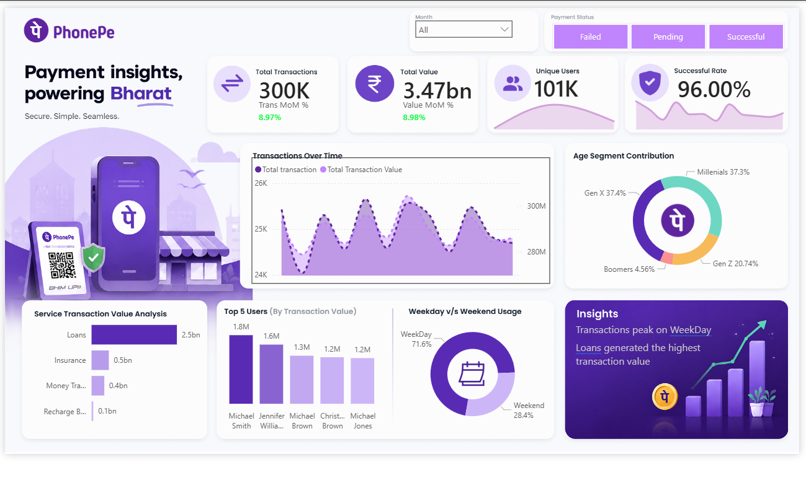

# 📊 PhonePe Transaction Analytics Dashboard

An end-to-end analytics project built using **Python** and **Power BI** to analyze PhonePe transaction data. The project combines data preprocessing, exploratory data analysis (EDA), statistical analysis, feature engineering, and interactive business intelligence to uncover meaningful transaction patterns and user behavior.

The workflow begins with Python-based data preparation and analysis, followed by the development of an interactive Power BI dashboard featuring KPIs, DAX measures, custom tooltips, and dynamic business insights.

---

## 🚀 Features

- 📈 Interactive Power BI Dashboard
- 📊 KPI Cards with Month-over-Month (MoM) Analysis
- 📅 Dynamic Weekday vs Weekend Insights
- 💳 Dynamic Highest Transaction Service Detection
- 👥 Age-wise User Segmentation
- 🏆 Top 5 Users by Transaction Value
- 📉 Transaction Trend Analysis
- 🎯 Interactive Slicers & Report Page Tooltips
- 🐍 Python-based Exploratory Data Analysis (EDA)
- 📐 Statistical Analysis using SciPy

---

## 📷 Dashboard Preview



---

## 📂 Project Workflow

| Stage | Description |
|-------|-------------|
| 📥 Data Collection | Imported PhonePe transaction and user datasets from Excel |
| 🧹 Data Cleaning | Cleaned, transformed, and standardized the datasets using Python |
| ⚙️ Feature Engineering | Created age groups, date features, and derived columns for analysis |
| 📊 Exploratory Data Analysis | Analyzed transaction trends, user behavior, and service usage |
| 📈 Statistical Analysis | Performed hypothesis testing and RFM segmentation using SciPy |
| 🗄️ Data Modeling | Built relationships and DAX measures in Power BI |
| 📉 Dashboard Development | Designed interactive dashboards with KPIs, charts, slicers, and tooltips |
| 💡 Business Insights | Generated dynamic DAX-based insights that automatically update with filters |

---

## 🐍 Python Analysis

The dataset was analyzed and prepared using Python before creating the Power BI dashboard.

| Module | Purpose |
|---------|---------|
| 🧹 Data Cleaning | Removed inconsistencies and prepared the dataset |
| ⚙️ Feature Engineering | Created age segments and date-related features |
| 📊 Exploratory Data Analysis | Analyzed transaction patterns and user behavior |
| 💳 Service Analysis | Compared transaction value across different services |
| ❌ Failure Analysis | Examined successful and failed transactions |
| 👥 RFM Analysis | Segmented users based on transaction behavior |
| 📈 Statistical Analysis | Performed hypothesis testing using SciPy |
| 📉 Data Visualization | Created charts using Matplotlib and Seaborn |

---

## 📈 Power BI Dashboard Features

| Category | Features |
|----------|----------|
| 📊 KPI Cards | Total Transactions, Transaction Value, Unique Users, Success Rate, MoM Growth |
| 📈 Trend Analysis | Monthly Transaction Trends |
| 👥 User Analysis | Age Segment Contribution & Top 5 Users |
| 💳 Service Analysis | Service-wise Transaction Value |
| 📅 Time Analysis | Weekday vs Weekend Transactions |
| 🎯 Interactive Features | Month Slicer, Payment Status Filter, Report Page Tooltips |
| 💡 Dynamic Insights | DAX-powered business insights that update with filters |

---

## 💡 Dynamic Business Insights

The dashboard automatically generates business insights based on the selected filters.

Some examples include:

- 📅 Transactions peak on weekdays.
- 💳 Loans generate the highest transaction value.
- 👥 Gen X and Millennials contribute almost equally to overall transactions.

These insights are generated dynamically using DAX measures and automatically update based on user selections.

---

## 🧮 Key DAX Measures

| Measure | Purpose |
|---------|----------|
| Total Transactions | Calculates the total number of successful transactions |
| Total Transaction Value | Calculates total transaction value |
| Unique Users | Counts unique users |
| Success Rate | Calculates successful transaction percentage |
| Transactions PM | Previous Month Transactions |
| Transaction Value PM | Previous Month Transaction Value |
| Transactions MoM % | Month-over-Month Transaction Growth |
| Transaction Value MoM % | Month-over-Month Transaction Value Growth |
| Dynamic Insight Measures | Generates context-aware business insights |

---

## 📌 Key Business Insights

- 💳 Loans contribute the highest transaction value among all services.
- 📅 Weekdays account for the highest transaction volume.
- 👥 Gen X and Millennials contribute nearly equally to total transactions.
- 📈 Transaction trends can be explored interactively using slicers and filters.

---

## 🛠️ Tech Stack

### Python

- Python
- Pandas
- NumPy
- Matplotlib
- Seaborn
- SciPy

### Power BI

- Power BI Desktop
- Power Query
- DAX
- Data Modeling

---

## 🎯 Skills Demonstrated

- Data Cleaning
- Data Transformation
- Feature Engineering
- Exploratory Data Analysis (EDA)
- Statistical Analysis
- Business Intelligence
- Dashboard Design
- Power BI
- DAX
- Power Query
- Data Modeling
- Interactive Reporting
- Business Storytelling
- Data Visualization

---

## 📁 Repository Structure

```text
PhonePe-Transaction-Analytics/
│
├── Dashboard/
│   └── PhonePe Dashboard.pbix
│
├── Notebook/
│   └── PhonePe_Analysis.ipynb
│
├── Images/
│   ├── Dashboard.png
│   ├── Tooltip1.png
│   └── Tooltip2.png
│
├── Data/
│   └── PhonePe-Final-Dataset.xlsx
│
├── requirements.txt
└── README.md
```

---

## ⭐ Acknowledgements

This project was developed for learning and portfolio purposes to demonstrate data analysis, business intelligence, dashboard development, and storytelling using Python and Power BI.
